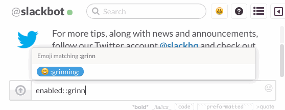

# Slack Randomizer
Add a button to your slack desktop app that, when enabled, replace all emoji in your messages with another, random emoji 5 seconds after you send them.

## Demo

## Enable Dev Tools
To enable the inspector in the slack desktop app, issue the following slash command:
`/macgap.app.enableDeveloperTools()`
